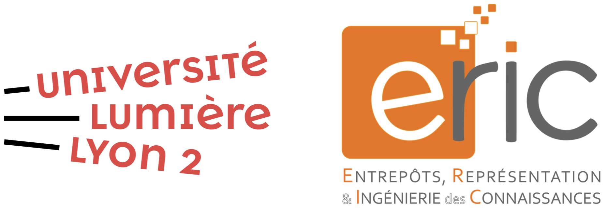

# Master MIASHS - Université Lumière Lyon 2

Ce dépôt est destiné aux étudiantes et étudiants du **Master MIASHS** à l’**Université Lumière Lyon 2**.

## Contenu du dépôt

### Master 1 - Rappels & Projets
- **Supports de cours** : Session d’[**Algèbre**](/Algebre_M1/Cours_M1_ALGEBRE_Beamer.pdf) et d’**Analyse** (PDF).
- **Sujets de projets** : énoncés détaillés + consignes de rendu en [algèbre](/Algebre_M1/Projet-Algebre.pdf) ([english version here](/Algebre_M1/ENGLISH-Projet-Algebre.pdf)).

### Master 2 - À venir
- **To Be Announced** (projets, ressources avancées, jeux de données…).

---

This repository is intended for students of the **MIASHS Master’s program** at **Université Lumière Lyon 2**.

## Repository Contents

### Master 1 – Recaps & Projects
- **Course materials**: [**Algebra**](/Algebre_M1/Cours_M1_ALGEBRE_Beamer.pdf) and **Analysis** sessions (PDF).
- **Project briefs**: detailed assignments + submission guidelines in [Algebra](/Algebre_M1/ENGLISH-Projet-Algebre.pdf).

### Master 2 – Coming Soon
- **To Be Announced** (projects, advanced resources, datasets, etc.).
