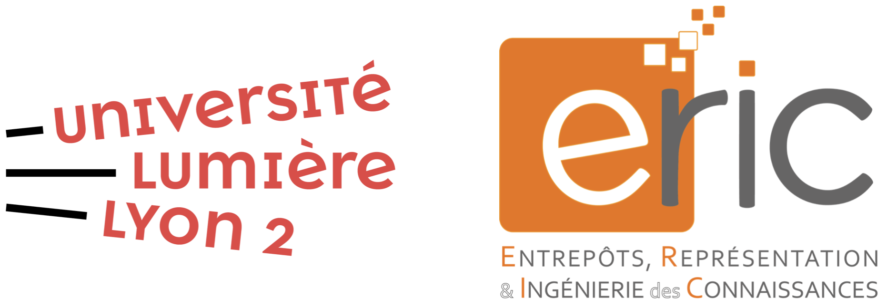

# Master MIASHS — Université Lumière Lyon 2

## Français

Ce dépôt est destiné aux étudiantes et étudiants du **Master MIASHS** de l’**Université Lumière Lyon 2**.

Il regroupe les supports de cours, exercices et ressources complémentaires mis à disposition au cours de l’année universitaire.

### Contenu prévu

* Algèbre linéaire
* Analyse mathématique

Le contenu sera progressivement complété et mis à jour au fil de l’année.

---

## English

This repository is intended for students enrolled in the **MIASHS Master’s programme** at **Université Lumière Lyon 2**.

It contains lecture notes, exercises, and additional resources made available throughout the academic year.

### Planned content

* Linear algebra
* Mathematical analysis

The repository will be progressively completed and updated throughout the year.
